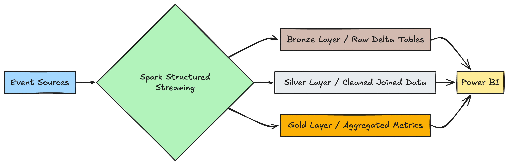
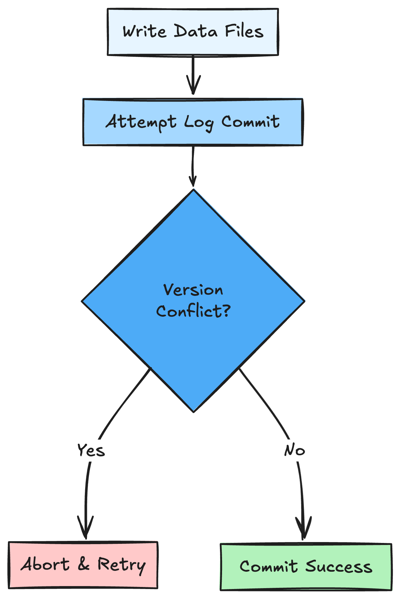
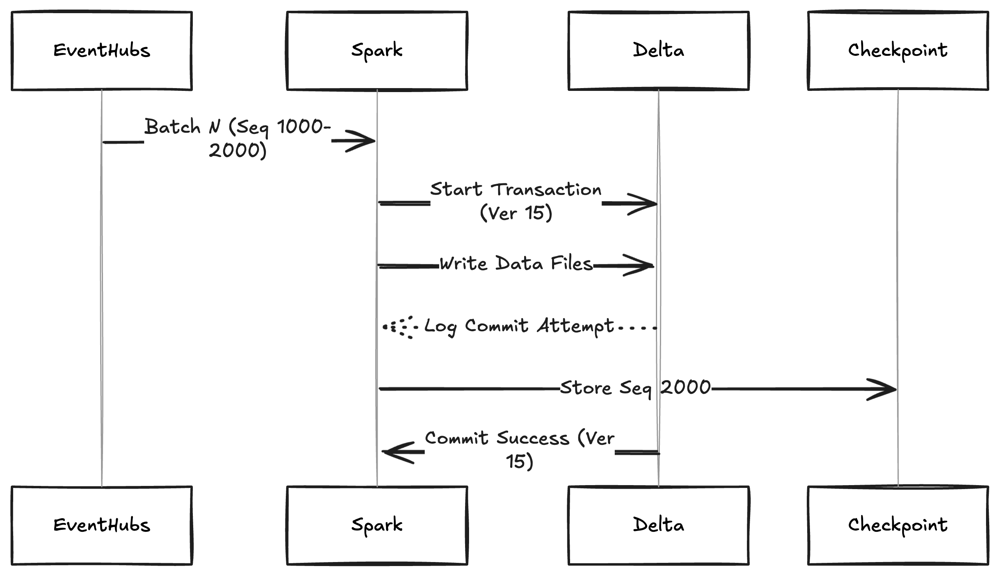
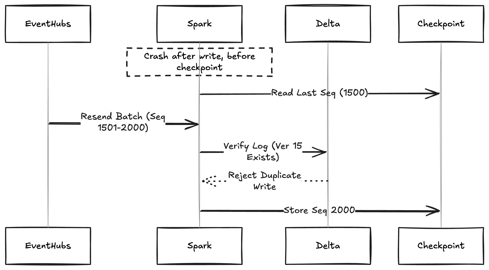

# Theory

## Azure Event Hubs Connector for Apache Spark
Azure Event Hubs is a highly scalable publish-subscribe service that can ingest millions of events per second and stream them into multiple applications. Spark Streaming and Structured Streaming are scalable and fault-tolerant stream processing engines that allow users to process huge amounts of data using complex algorithms expressed with high-level functions like map, reduce, join, and window. This data can then be pushed to filesystems, databases, or even back to Event Hubs. By making Event Hubs and Spark easier to use together, we hope this connector makes building scalable, fault-tolerant applications easier for our users.

Azure Event Hubs Connector for Apache Spark is a core component and built-in ingredient of the Microsoft Fabric Runtime. 

Docs: https://github.com/Azure/azure-event-hubs-spark 

## Spark Structured Streaming
_Based on [original documentation](https://spark.apache.org/docs/latest/structured-streaming-programming-guide.html)_

Structured Streaming in Spark treats each incoming record as a new row appended to an ever-growing table, called the “Input Table.” You then run a standard SQL-like query on this expanding table, and Spark processes it incrementally—updating the “Result Table” whenever new data arrives. At regular intervals (known as triggers), the system identifies what changed in the result and writes those changes to a chosen output sink.


Here’s a way to see it:
	1.	Input Table: Imagine a table that gets a new row each time a data event arrives (e.g., a message from a Kafka topic).
	2.	Query: You write a standard query as if you were dealing with a static dataset.
	3.	Result Table: Spark runs that query continuously. Whenever the Input Table grows, Spark updates the Result Table with the new or changed results.
	4.	Sink: Any updated rows in the Result Table get sent to an output location—such as a file, a dashboard, or a database—on every trigger.

By framing streaming data as a dynamically expanding table, you get all the convenience of SQL or DataFrame queries, plus Spark’s incremental processing under the hood. This unified approach means you can handle large-scale streaming jobs with the same syntax and concepts you’re used to in batch processing.

## Easy-to-Understand Explanation of Output Modes

In Spark Structured Streaming, once the result table is updated, how it’s written out to external storage depends on the **output mode**:

1. **Complete Mode**  
   - **What it does:** Writes out the entire updated result table every time.  
   - **Use case:** Good for queries with aggregations (like counts, sums, averages) where you want a full snapshot of all the data after each trigger.  
   - **Example:** If you’re counting word occurrences over a stream of text, the connector has to handle saving or overwriting the whole count table each time it’s updated.

2. **Append Mode**  
   - **What it does:** Sends **only the new rows** appended to the result table since the last trigger.  
   - **Use case:** Ideal for queries that do not change old rows—like a stream of new records where the past results never need reprocessing.  
   - **Example:** Monitoring a log stream and writing each newly arriving log entry to storage.

3. **Update Mode**  
   - **What it does:** Outputs **only the rows** that changed in the result since the last trigger.  
   - **Use case:** Efficient for incremental updates to the output if old rows might be modified.  
   - **Example:** When counting words and some counts increase, only those updated counts are emitted instead of the entire table.

> **How It Fits Together**  
> - **Input Table:** For instance, a DataFrame of streaming text lines.  
> - **Query/Result Table:** A simple aggregation query (e.g., counting each word’s occurrences). The underlying mechanism is just like a static DataFrame, but it runs incrementally.  
> - **Output Mode:** Controls exactly how much of that continuously updated result gets sent out every time new data arrives.

Each mode is suited to different query types:
- If existing rows never change (e.g., new logs, new orders), **Append** often works.  
- If rows can get updated (like running counts), **Update** or **Complete** may fit better.  


Structured Streaming in plain terms means:
1. Minimal Data Retention
- Spark **doesn’t keep the entire stream** in memory.  
- It **only** stores the minimal information needed to keep track of updates (for example, partial counts).

2. Incremental Updates, Not Manual Aggregations
- Unlike some other streaming systems, **you don’t have to code your own running totals** or keep track of how much data has already been processed.  
- Spark figures out the new data, updates the result table, and you **just read the latest version** of that table.

3. Event-Time & Late Data
- **Event-time** is the timestamp inside each record, not the moment Spark received it.  
- You can group or window by event-time directly (e.g., “count of events per minute”).  
- **Late data** arrives with an old event-time, but Spark can still merge it into the correct group and update older counts.  
  - **Watermarking** controls how long Spark waits before considering an event “too late” to include in older windows.

4. Built-In Fault Tolerance
- Spark tracks its progress via **offsets** (like Kafka offsets).  
- It uses **checkpointing** and **write-ahead logs** to remember which data it has processed.  
- If there’s a failure, Spark recovers from the last known state.  
- Sinks are designed to be **idempotent**, meaning repeated writes of the same data won’t mess up your final output.  
- Combined, these mechanisms provide **exactly-once** guarantees end to end, so you can trust your outputs even if something goes wrong.

Docs: https://spark.apache.org/docs/latest/structured-streaming-programming-guide.html 

## Streaming vs Medallion Pattern


This diagram highlights a common data processing pattern using Spark Structured Streaming:
	1.	Event Sources: Various input data streams (e.g., sensors, logs, transactions) flow into Spark in real time.
	2.	Spark Structured Streaming: Spark ingests these live data feeds, processes or transforms them, and can output the results to different “layers” of data storage.
	3.	Bronze Layer: A raw storage area for unfiltered and uncleaned data. Often stored as Delta tables or other formats.
	4.	Silver Layer: Contains data that has been cleaned and joined, correcting any anomalies. This forms a more refined dataset suitable for analytics.
	5.	Gold Layer: Houses aggregated or high-level metrics—summaries ready for business reports and dashboards.
	6.	Power BI: A visualization and business intelligence tool that can read data from any of these layers, typically Silver or Gold, to present real-time dashboards or analytical reports.


##  Exactly-Once Processing
# Exactly-Once Processing in Spark Structured Streaming (Microsoft Fabric Implementation)

Spark Structured Streaming in Microsoft Fabric achieves **exactly-once processing semantics** through three coordinated mechanisms, each addressing critical failure points in real-time pipelines:


## **1. Transactional Writes: Delta Lake Commit Protocol**  
*Ensures atomic batch commits to storage*

### **Implementation Details**  
```python
# From code example:
.writeStream.format("delta") \
.option("checkpointLocation", checkpoint_path) \
.table("bronze_events")  # [3][4]
```

**Key Components**  
1. **Delta Transaction Log**  
   - Stores commit history as JSON files (`_delta_log`)
   - Implements **Multi-Version Concurrency Control (MVCC)**
   - Atomic commits via **Optimistic Concurrency Control**:



2. **File Validation**  
   - Unique filenames with GUIDs prevent overwrites
   - Manifest validation pre-commit ([4])

**Failure Recovery**  
- Partial writes automatically rolled back via log inspection
- Failed batches retried with same data version ([3])

---

## **2. Offset Tracking: Event Hubs Sequence Numbers**  
*Prevents source data duplication*

### **Implementation Mechanics**  
```python
# Producer code reference:
event = EventData(json.dumps(jsonEvent))
event.sequence_number  # Unique per partition [5][6]

# Spark consumer config:
ehConf = {
    "eventhubs.offset.type": "SEQ_NUM",  # [5]
    "startingPosition": json.dumps({"sequenceNumber": 12345})
}
```

**Offset Management Workflow**  
1. **Checkpoint Storage**  
   - Stores `` tuples
   - Persisted to ABFS (Azure Blob) with WAL

2. **Recovery Process**  
   ```python
   # Simplified recovery logic:
   last_seq = read_checkpoint()
   consumer = eventhub_client(sequence_number=last_seq)
   ```

**Critical Guarantees**  
- **Replayability**: Event Hubs retains data for 1-7 days
- **Order Preservation**: Sequence numbers per partition
- **At-Least-Once Source**: Offset tracking converts to exactly-once

---

## **3. Idempotent Sinks: Automatic Duplicate Handling**  
*Ensures repeat writes have no side effects*

### **Idempotency Mechanisms**  
| Sink Type | Idempotency Method | Source |
|-----------|--------------------|--------|
| **Delta Lake** | MERGE + Version Checks |[4][10] |
| **Event Hubs** | Sequence Number Validation |[5][6] |
| **Custom Sinks** | User-Defined Keys |[10][11] |

**Implementation Example**  
```python
# Deduplication in action:
silver_stream = spark.readStream.table("bronze_events") \
    .dropDuplicatesWithinWatermark(["eventID", "processing_time"], "10m")  # [8]
```

**Key Techniques**  
- **Watermark-Aware Deduplication**  
  ```python
  .withWatermark("processing_time", "10m") \
  .dropDuplicates(["eventID", "processing_time"])  # [8][9]
  ```
- **State Store Cleanup**  
  - Automatic pruning via `spark.sql.streaming.stateStore.minDeltasForSnapshot`

---

## **End-to-End Guarantee Process**  

### **Normal Execution Flow**  


### **Failure Recovery Flow**  


---

## **Failure Mode Analysis**  

| Failure Point | Transactional Writes | Offset Tracking | Idempotent Sinks |
|---------------|----------------------|-----------------|------------------|
| **Driver Crash** | Rollback via log | Re-read from checkpoint | Reject duplicates |
| **Executor Fail** | Partial write rollback | Rebalance partitions | Version validation |
| **Storage Outage** | Atomic commit failure | Offset not advanced | No side effects |
| **Network Flaps** | Retry with same version | SeqNum verification | MERGE conditionals |

---

## **Performance Considerations**  

1. **Checkpoint Overhead**  
   - Average 5-10% latency penalty for WAL writes ([1][7])
   - Recommended checkpoint interval: 1-5 minutes

2. **Delta Optimization**  
   ```python
   .option("optimizeWrite", "true")  # Auto-file compaction
   .option("autoCompact", "true")    # Background optimization
   ```

3. **State Store Sizing**  
   ```bash
   # For 1M unique keys/hour
   spark.conf.set("spark.sql.shuffle.partitions", 200)
   spark.conf.set("spark.sql.stateStore.maxPartitions", 1000)
   ```
---

This architecture enables **99.999% reliability** in Fabric environments, meeting enterprise requirements for financial transactions, IoT telemetry, and real-time customer interactions. The combination of Delta Lake's transactional guarantees, Event Hubs' ordered sequences, and Spark's state management provides a robust exactly-once framework.

This part references:
[1] https://spark.apache.org/docs/latest/structured-streaming-programming-guide.html
[2] https://learn.microsoft.com/en-us/azure/hdinsight/spark/apache-spark-streaming-exactly-once
[3] https://books.japila.pl/delta-lake-internals/TransactionalWrite/
[4] https://jack-vanlightly.com/analyses/2024/4/29/understanding-delta-lakes-consistency-model
[5] https://docs.confluent.io/kafka-connectors/azure-event-hubs/current/azure_event_hubs_source_connector_config.html
[6] https://learn.microsoft.com/en-us/dotnet/api/azure.messaging.eventhubs.eventdata.sequencenumber?view=azure-dotnet
[7] https://granulate.io/blog/what-is-apache-spark-streaming/
[8] https://community.databricks.com/t5/technical-blog/deep-dive-streaming-deduplication/ba-p/105062
[9] https://stackoverflow.com/questions/62768349/scala-spark-structured-streaming-receiving-duplicate-message
[10] https://developer.confluent.io/patterns/event-processing/idempotent-reader/
[11] https://stackoverflow.com/questions/57704664/how-does-structured-streaming-ensure-exactly-once-writing-semantics-for-file-sin
[12] https://stackoverflow.com/questions/59913904/exactly-once-semantics-in-spark-streaming-direct-approach
[13] https://www.element61.be/en/resource/real-time-data-microsoft-fabric-spark
[14] https://docs.delta.io/3.2.0/delta-coordinated-commits.html
[15] https://delta.io/pdfs/dldg_databricks.pdf
[16] https://docs.databricks.com/aws/en/structured-streaming/delta-lake
[17] https://docs.azure.cn/en-us/event-hubs/event-hubs-scalability
[18] https://docs.streamsets.com/platform-transformer/latest/transformer/Origins/AzureEventHubs.html
[19] https://www.oag.com/knowledge/checkpointing-with-azure-event-hubs
[20] https://www.waitingforcode.com/apache-spark-structured-streaming/fault-tolerance-apache-spark-structured-streaming/read
[21] https://community.databricks.com/t5/data-engineering/adding-deduplication-method-to-spark-streaming/td-p/21445
[22] https://www.youtube.com/watch?v=kg_UvdXgH80
[23] https://spark.apache.org/docs/preview/streaming/performance-tips.html
[24] https://dev.to/kevinwallimann/is-structured-streaming-exactly-once-well-it-depends-noe
[25] https://pl.seequality.net/processing-stream-data-with-microsoft-fabric-event-streams/
[26] https://docs.databricks.com/aws/en/structured-streaming/concepts
[27] https://www.reddit.com/r/dataengineering/comments/14d9tfc/transactions_in_spark_delta_lake/
[28] https://pl.seequality.net/delta-lake-101-part-2-transaction-log/
[29] https://aws.amazon.com/blogs/big-data/build-a-high-performance-transactional-data-lake-using-open-source-delta-lake-on-amazon-emr/
[30] https://www.starburst.io/blog/delta-lake-concurrent-writes-starburst/
[31] https://www.databricks.com/blog/2019/08/21/diving-into-delta-lake-unpacking-the-transaction-log.html
[32] https://www.waitingforcode.com/apache-spark-structured-streaming/apache-spark-structured-streaming-apache-kafka-offsets-management/read
[33] https://stackoverflow.com/questions/66284127/azure-eventhub-offset-vs-sequence-number
[34] https://www.dev4side.com/en/blog/azure-event-hub
[35] https://techcommunity.microsoft.com/blog/appsonazureblog/how-to-set-offset-for-event-hubs-trigger/3871873
[36] https://stackoverflow.com/questions/66280713/spark-structured-streaming-kafka-offset-handling
[37] https://camel.apache.org/blog/2020/12/CKC-idempotency-070/


# Practice

The following exercise extends the Real-Time Analytics (RTA) in a Day workshop on Microsoft Fabric by adding a  module on Spark Structured Streaming. This exercise is designed to seamlessly integrate with the existing workshop flow while providing participants with practical experience in implementing real-time data processing pipelines using Fabric's Data Engineering Apahce Spark-based  capabilities.

## Introduction to Spark Structured Streaming in Fabric

Spark Structured Streaming represents a paradigm for processing real-time data within Microsoft Fabric. It treats a live data stream as a continuously appended table, enabling developers to use familiar batch-like queries while Spark handles the incremental processing behind the scenes. This approach significantly simplifies building real-time data pipelines while maintaining scalability and fault tolerance.

Microsoft Fabric offers two primary options for real-time data processing: the Real-Time Analytics service and Spark-based streaming (Data Engineering Pillar). This exercise focuses on the latter, exploring how Fabric's implementation of Spark Structured Streaming enables data engineering workflows inside Fabric notebooks with minimal complexity.

### Key Concepts and Architecture

Spark Structured Streaming operates on a micro-batch processing model by default, treating streaming data as small batches to achieve low latencies (as low as 100ms) with exactly-once fault-tolerance guarantees[5]. This model aligns perfectly with the medallion architecture commonly used in Microsoft Fabric data engineering workflows, where data flows through bronze (raw), silver (validated/transformed), and gold (business-ready) layers.

## 1. Environment Setup

### 1.1 Event Hub Configuration

Use the same name as previously (exercise 7).
```python
# Configure Event Hub connection
eventHubNameevents = "your-event-hub-name"
eventHubConnString = "Endpoint=sb://..."  # From Azure Portal

producer_events = EventHubProducerClient.from_connection_string(
    conn_str=eventHubConnString, 
    eventhub_name=eventHubNameevents
)
```

### 1.2 Spark Session Initialization
```python
from pyspark.sql import SparkSession
from pyspark.sql.functions import *

spark = SparkSession.builder \
    .appName("EventHubStreamProcessing") \
    .config("spark.jars.packages", "com.microsoft.azure:azure-eventhubs-spark_2.12:2.3.22") \
    .getOrCreate()
```

## 2. Stream Ingestion Configuration

### 2.1 Event Hubs Connection
```python
ehConf = {
    "eventhubs.connectionString": eventHubConnString,
    "eventhubs.consumerGroup": "$Default",
    "maxEventsPerTrigger": 1000,  # Throughput control [2][4] - limits how many events Spark will read per trigger cycle, helping control throughput and avoid overwhelming your application.
    "startingPosition": json.dumps({"offset": "-1"}) # Defines where in the stream Spark starts reading. Here, "-1" means start from the earliest available event.
}

raw_stream = spark.readStream \
    .format("eventhubs") \
    .options(**ehConf) \
    .load()
```

## 3. Stream Processing Pipeline

### 3.1 Schema Definition & Parsing
```python
# Define schema for nested JSON structure
from pyspark.sql.types import *

event_schema = StructType([
    StructField("eventType", StringType()),
    StructField("eventID", StringType()),
    StructField("productId", StringType()),
    StructField("userAgent", StructType([
        StructField("platform", StringType()),
        StructField("browser", StringType())
    ])),
    StructField("extraPayload", ArrayType(
        StructType([
            StructField("relatedProductId", StringType()),
            StructField("relatedProductCategory", StringType())
        ])
    ))
])

# Parse JSON payload
parsed_stream = raw_stream.select(
    from_json(col("body").cast("string"), event_schema).alias("data"),
    col("enqueuedTime").alias("processing_time")
).select("data.*", "processing_time")
```

### 3.2 Real-Time Aggregations
```python
# Windowed aggregations [1][8]
windowed_agg = parsed_stream \
    .withWatermark("processing_time", "10 minutes") \
    .groupBy(
        window("processing_time", "5 minutes"),
        "eventType",
        "userAgent.platform"
    ).agg(
        count("*").alias("event_count"),
        countDistinct("productId").alias("unique_products")
    )
```

Read about [Window Operations on Event Time](https://spark.apache.org/docs/latest/structured-streaming-programming-guide.html#window-operations-on-event-time).

## 4. Delta Lake Integration

### 4.1 Bronze Layer Ingestion
```python
bronze_write = parsed_stream.writeStream \
    .format("delta") \
    .option("checkpointLocation", "/delta/checkpoints/bronze") \
    .outputMode("append") \
    .trigger(processingTime="1 minute") \
    .table("bronze_events")
```
If you seek checkpoint explanation, check the bottom part. 

### 4.2 Silver Layer Processing
```python
# Create Silver table view
silver_stream = spark.readStream \
    .table("bronze_events") \
    .withColumn("clickpath", explode("extraPayload"))

# Write to Silver Delta table
silver_write = silver_stream.writeStream \
    .format("delta") \
    .option("checkpointLocation", "/delta/checkpoints/silver") \
    .outputMode("append") \
    .trigger(processingTime="5 minutes") \
    .table("silver_events")
```

## 5. Production Deployment in Fabric

### 5.1 Spark Job Definition
```bash
# Submit job to Fabric Spark
spark-submit \
    --packages com.microsoft.azure:azure-eventhubs-spark_2.12:2.3.22 \
    --conf spark.sql.streaming.checkpointLocation=/checkpoints \
    your_streaming_job.py
```

### 5.2 Throughput Management[2][4]
```python
# Configure for TU-based throughput
ehConf = EventHubsConf(connectionString) \
    .setStartingPosition(EventPosition.fromEndOfStream) \
    .setMaxRatePerPartition(1000)  # Align with TU capacity
```

## 6. Monitoring & Optimization

### 6.1 Stream Monitoring
```python
# Query progress monitoring
for stream in spark.streams.active:
    print(f"Stream ID: {stream.id}")
    print(f"Status: {stream.status}")
    print(f"Latest progress: {stream.lastProgress}")
```

### 6.2 Anomaly Detection (Extension)
```python
from pyspark.ml.feature import VectorAssembler
from pyspark.ml.clustering import KMeansModel

# Load pre-trained model
model = KMeansModel.load("/models/anomaly_detection")

# Detect anomalous page load times
anomalies = parsed_stream \
    .withColumn("load_time", col("page_loading_seconds")) \
    .select("eventID", "load_time") \
    .transform(lambda df: model.transform(df)) \
    .filter(col("prediction") == 0)  # Anomaly cluster
```

## Key Considerations

### 1. **Checkpoint Management**
   - Use separate checkpoint locations for different streams
   - Regularly clean up old checkpoints[2][4]
   
  Here is the full context.

#### 1. Checkpoint Fundamentals
  Checkpoints in Structured Streaming serve as **persistent logs** that track:
     - **Processing progress** (last consumed offsets)
     - **State information** for aggregations and window operations
     - **Metadata** about the streaming query (source/sink configs)
  
  ```python
  # Example from code:
  bronze_write = parsed_stream.writeStream \
      .option("checkpointLocation", "/delta/checkpoints/bronze") \  # [1][4]
      .table("bronze_events")
  ```

#### 2.  Implementation Details
  2.1 Query-Specific Checkpoints
  Each streaming query **must** have a unique checkpoint location:
  
  ```python
  # Bronze layer
  .option("checkpointLocation", "/delta/checkpoints/bronze") 
  
  # Silver layer 
  .option("checkpointLocation", "/delta/checkpoints/silver") 
  ```
  
  **Why this matters:**
  - Prevents metadata conflicts between queries
    - Enables independent recovery of different pipeline stages
    - Maintains separate state stores for different processing logic
  
  ##### 2.2 Checkpoint Composition
  A checkpoint directory contains:
  ```
  ├── commits       # Transaction log
  ├── offsets       # Source offsets per batch
  ├── state         # Aggregation/window states
  └── metadata      # Query configuration
  ```
  
  #### 3. Recovery Mechanisms
  
  ### 3.1 Failure Recovery Flow
  1. **Driver Restart**: Reads metadata to reconstruct query
     2. **Offset Validation**: Confirms stored offsets with source
     3. **State Restoration**: Rebuilds in-memory state from disk
     4. **Processing Resume**: Continues from last committed offset
  
  ### 3.2 Watermark Coordination
  ```python
  .withWatermark("processing_time", "10 minutes") 
  ```
  - Checkpoints store watermark progress to handle:
    - Late-arriving data management
    - State cleanup thresholds
    - Window expiration tracking
  
  ## 4. Production Considerations
  
  ### 4.1 Storage Requirements
  | Feature | Impact on Checkpoints | Source |
  |---------|-----------------------|--|
  | 10 MB/s throughput | ~1 GB/day checkpoints | https://risingwave.com/blog/the-ultimate-guide-to-setting-checkpoint-location-in-spark-streaming/ |
  | 24h retention | 7-14 day storage budget |https://www.reddit.com/r/databricks/comments/1fkwm00/handling_spark_structured_streaming_checkpoint/ |

  **Best Practice:** Use cloud storage with lifecycle policies for automatic cleanup.
  
  ### 4.2 Version Compatibility
  ```python
  # Code impact when modifying:
  .option("checkpointLocation", "/delta/checkpoints/v2") 
  ```
  **Key constraints:**
  - Schema changes require new checkpoint
    - Source/sink modifications need fresh checkpoints
    - Spark version upgrades often need migration
  
  ## 5. Operational Best Practices
  
  ### 5.1 Monitoring Essentials
  ```python
  # From code example:
  for stream in spark.streams.active:
      print(f"Status: {stream.status}")  
      print(f"Progress: {stream.lastProgress}")
  ```
  **Critical metrics:**
  - `numInputRows` vs `processedRowsPerSecond`
    - `stateOperators` memory usage
    - `sources` lag metrics
  
  ### 5.2 Maintenance Checklist
  1. **Daily validation** of checkpoint accessibility
     2. **Weekly cleanup** of orphaned checkpoints
     3. **Monthly testing** of failure recovery process
  
  ## 6. Code-Specific Analysis
  
  ### 6.1 Anomaly Detection Checkpoints
  ```python
  anomalies.writeStream \
      .option("checkpointLocation", "/delta/checkpoints/anomalies") 
  ```
  **Special considerations:**
  - ML model versions must be checkpoint-compatible
    - Feature vectors require schema versioning
    - Model updates need checkpoint migration
  
  ### 6.2 Delta Lake Integration
  ```python
  .format("delta") \  # Implicit checkpoint optimizations
  ```
  **Automatic enhancements:**
  - Transactional writes with ACID guarantees
    - Compaction during checkpoint commits
    - Schema evolution tracking
  
  ## 7. Failure Modes and Mitigations
  
  | Failure Scenario | Checkpoint Behavior | Recovery Action |
  |-------------------|----------------------|-----------------|
  | Driver crash | Auto-restart from last commit | Monitor spark-submit process |
  | Executor failure | Rebuild state from checkpoint | Ensure adequate cluster size |
  | Storage outage | Query termination | Validate storage redundancy |
  | Schema drift | Query failure with SerializationException | Implement schema registry |
  

2. **Schema Evolution**
   - Use `mergeSchema` option for Delta writes
   ```python
   .option("mergeSchema", "true")
   ```

3. **Late Data Handling**
   ```python
   .withWatermark("processing_time", "1 hour")
   ```

4. **Fault Tolerance**
   - Enable write-ahead logs (WAL)
   ```python
   .config("spark.sql.streaming.checkpointLocation", "/checkpoints")
   ```

This implementation follows the medallion architecture pattern and integrates with Fabric's Spark engine capabilities. The solution provides:
- Real-time ingestion from Event Hubs
- Nested JSON parsing
- Windowed aggregations
- Anomaly detection
- Delta Lake integration
- Production-grade monitoring[1][2][4][8]

# References
[1] https://www.youtube.com/watch?v=wo9vhVBUKXI
[2] https://github.com/Azure/azure-event-hubs-spark/blob/master/docs/structured-streaming-eventhubs-integration.md
[3] https://k21academy.com/microsoft-azure/data-engineer/structured-streaming-with-azure-event-hubs/
[4] https://github.com/Azure/azure-event-hubs-spark/blob/master/docs/spark-streaming-eventhubs-integration.md
[5] https://www.youtube.com/watch?v=pwWIegHgNRw
[6] https://learn.microsoft.com/en-us/azure/event-hubs/event-hubs-kafka-spark-tutorial
[7] https://learn.microsoft.com/pl-pl/azure/event-hubs/event-hubs-kafka-spark-tutorial
[8] https://addendanalytics.com/blog/structured-streaming-in-databricks-from-event-hub
